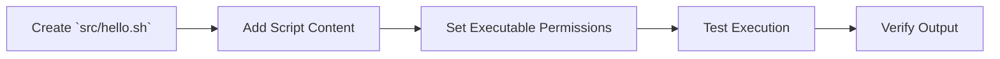

## Problem Statement
The project requires a foundational and minimal executable component to serve as an initial verification step for environment setup and a clear, simple example of script execution within the `src/` directory. This "Hello World" script will validate basic scripting capabilities and provide a quick sanity check for developers.

## Solution Overview
This document specifies the creation of a basic Bash script named `hello.sh` located in the `src/` directory. The script's sole function will be to print the string "Hello, World!" to the standard output and then exit. This simple script will act as the canonical initial executable for the project.

## Success Metrics
- The `hello.sh` script successfully executes from the command line.
- The script outputs "Hello, World!" to the console without errors.
- The script is placed in the `src/` directory and has executable permissions.

---

## Primary User Flow
```mermaid
graph LR
    A[Developer opens terminal] --> B[Navigates to project root]
    B --> C[Executes `src/hello.sh`]
    C --> D[Script prints "Hello, World!"]
    D --> E[Script exits successfully]
```

## User Stories
1.  **As a new developer**, I want to execute a simple "Hello World" script, so that I can quickly confirm my local development environment is set up correctly for running project scripts.
    *   Acceptance Criteria:
        - [X] The script runs without errors.
        - [X] The expected "Hello, World!" message is displayed.
    *   Edge Cases:
        - Script lacks executable permissions.
        - Bash interpreter not found in the environment's PATH.

## High-Level Architecture
```mermaid
graph TD
    User[User/Developer] --> Shell[Terminal/Shell Environment]
    Shell --> Bash[Bash Interpreter]
    Bash --> HelloScript[src/hello.sh]
    HelloScript --> StdOut[Standard Output (Console)]
```

## Component Breakdown
-   **Bash Interpreter**: The program responsible for executing Bash scripts.
-   **`src/hello.sh`**: The Bash script file containing the "Hello, World!" logic.

## API Design
Not applicable for this simple, standalone script.

## Endpoints
Not applicable.

## Data Flow
```mermaid
flowchart TD
    A[Execution Command: `./src/hello.sh`] --> B{Bash Interpreter Loads Script}
    B --> C[Reads `echo "Hello, World!"`]
    C --> D[Writes "Hello, World!" to StdOut]
    D --> E[Script Exits]
```

## Development Phases


## Implementation Priority
1.  **Foundation**: Create the `src/hello.sh` file with the initial content.
2.  **MVP Features**: Ensure the script is executable and prints the correct message.
3.  **Production Ready**: Verify consistency with project scripting standards (e.g., shebang).

## Devil's Advocate Analysis

```yaml
challenges:
  technical_risks:
    - risk: "Script permission issues"
      mitigation: "Include `chmod +x` in instructions; use version control to manage permissions if possible."

    - risk: "Inconsistent Bash versions across environments"
      mitigation: "Use standard, widely compatible Bash syntax; specify minimum Bash version if necessary."

  business_risks:
    - risk: "Lack of clarity on its purpose"
      mitigation: "Clearly document its role as a basic environment check and a simple example."

  edge_cases:
    - scenario: "User attempts to run script without `bash` installed."
      handling: "The system will report 'command not found'. This is an expected environmental dependency."

    - scenario: "User runs script from an incorrect directory."
      handling: "The script will not be found; user must navigate to the project root or provide the full path."
```

## Definition of Done
- [X] `src/hello.sh` file exists.
- [X] Script contains `#!/bin/bash` shebang.
- [X] Script contains `echo "Hello, World!"`.
- [X] Script has executable permissions (`+x`).
- [X] Script runs successfully from project root (`./src/hello.sh`).

## Measurable Outcomes
- Successful script execution rate: 100% on tested environments.
- Time to first successful script run for new developer: < 1 minute.

## Appendices

### Research & Alternatives Considered
The concept of a "Hello World" program is a universal standard for introducing programming languages and demonstrating basic execution. For Bash, the `echo` command is the most direct and common method for printing output to the console. No complex alternatives were considered as the goal is utmost simplicity.

### Code Snippet: `src/hello.sh`
```prps-agentic-v1/src/hello.sh#L1-2
#!/bin/bash
echo "Hello, World!"
```
