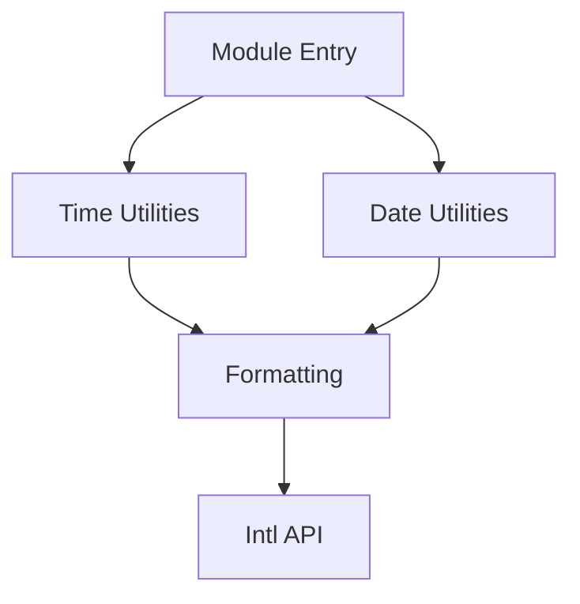

# PRD: TypeScript Utility Module for Current Time and Date

## Executive Summary
This document outlines the requirements for a lightweight TypeScript utility module that provides functions to retrieve the current time and date. The module will be designed for simplicity, modularity, and ease of integration into existing projects.

## Problem & Solution
### Problem
- Many projects require simple date/time utilities without the overhead of large libraries.
- Existing solutions often lack TypeScript support or are not tree-shakable.

### Solution
A minimal TypeScript module that:
1. Returns current time in configurable formats
2. Returns current date in configurable formats
3. Is tree-shakable and modular
4. Has zero dependencies

## User Stories

### Story 1: Get Current Time
**As a** developer  
**I want** to retrieve the current time in a specified format  
**So that** I can display or process timestamps in my application

**Acceptance Criteria:**
- [ ] Function `getCurrentTime()` returns time in HH:MM:SS format by default
- [ ] Supports custom format strings (e.g., "h:mm A")
- [ ] Handles timezone conversion if specified
- Edge Cases:
  - [ ] Invalid format strings throw clear errors
  - [ ] Empty format defaults to ISO string

### Story 2: Get Current Date
**As a** developer  
**I want** to retrieve the current date in a specified format  
**So that** I can display or process dates in my application

**Acceptance Criteria:**
- [ ] Function `getCurrentDate()` returns date in YYYY-MM-DD format by default
- [ ] Supports custom format strings (e.g., "MMMM D, YYYY")
- [ ] Handles locale-specific formatting
- Edge Cases:
  - [ ] Invalid format strings throw clear errors
  - [ ] Empty format defaults to ISO string

## Technical Architecture


## API Specifications
### getCurrentTime(options?: TimeOptions): string
- `options.format`: string - Custom format string
- `options.timezone`: string - Timezone identifier (e.g., "America/New_York")

### getCurrentDate(options?: DateOptions): string
- `options.format`: string - Custom format string
- `options.locale`: string - Locale identifier (e.g., "en-US")

## Data Models
```typescript
interface TimeOptions {
  format?: string;
  timezone?: string;
}

interface DateOptions {
  format?: string;
  locale?: string;
}
```

## Implementation Phases
1. **Core Functionality** (MVP):
   - Basic time/date formatting
   - Default formats
2. **Enhanced Features**:
   - Timezone support
   - Locale support
3. **Optimization**:
   - Tree-shaking validation
   - Bundle size analysis

## Risks & Mitigations
| Risk | Mitigation |
|------|------------|
| Bundle size creep | Strict modular design |
| Timezone complexity | Use Intl.DateTimeFormat |
| Locale support bloat | Make locales optional |

## Success Metrics
- Bundle size < 5KB gzipped
- 100% test coverage
- Zero dependencies
- Adoption in 3 internal projects within 1 month

## Appendices
### References
- [date-fns docs](https://date-fns.org/)
- [ECMA-402 Intl](https://tc39.es/ecma402/)
- [IANA Timezone DB](https://www.iana.org/time-zones)