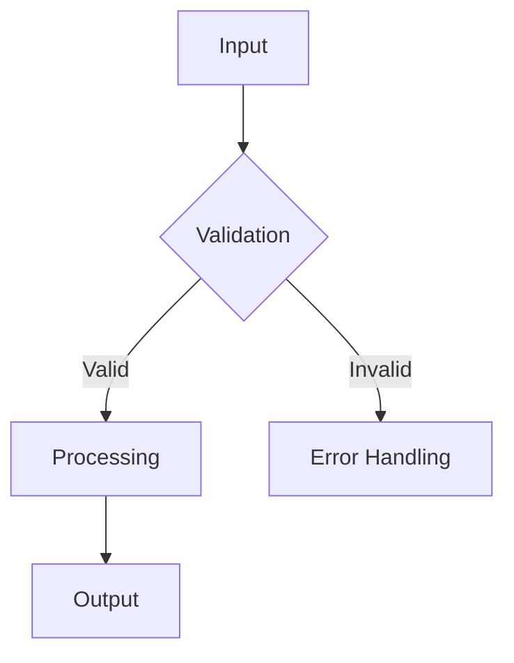

name: "Planning PRP Template v2 - PRD Generation with AI Validation"
description: |
  Comprehensive template for generating PRDs with built-in AI validation gates,
  autonomous execution, and modern TypeScript patterns.

## Purpose
Generate production-ready PRDs with:
- AI-optimized context
- Zero confirmation requirements
- Built-in validation gates

## Philosophy
1. **Autonomous First**: No interactive steps
2. **Validation-Centric**: AI-executable checks
3. **Pattern-Driven**: Reuse existing codebase patterns

---

## Template Variables
```yaml
arguments: "Feature description (e.g., 'Real-time notification service')"
file_slug: "kebab-case-feature-name"
```

## Core Sections

### 1. Architecture Blueprint


### 2. AI Validation Gates
```bash
# Syntax & Type Safety
npx tsc --noEmit

# AI Code Review
npx aicodemod verify \
  --prd $PRD_PATH \
  --min-score 85

# Performance Benchmark
node -e "
  const start = performance.now();
  require('./src').main();
  console.log('Duration:', performance.now() - start, 'ms');
"
```

### 3. Implementation Tasks
```markdown
1. [HIGH] Scaffold module (`src/modules/${file_slug}`)
2. [HIGH] Core functionality
3. [MED] Error handling
4. [MED] Tests
```

### 4. Context Requirements
```yaml
priority_files:
  - src/utils/date.ts
  - src/config.ts
  - test/fixtures/time.json

external_docs:
  - url: "https://date-fns.org/docs/"
    sections: ["Timezone Handling", "Formatting"]
```

## Quality Gates
```yaml
minimum_coverage: 80
max_cyclomatic: 15
performance_target: "<1ms"
```

## Anti-Patterns
```markdown
- ❌ Sync operations in async flow
- ❌ Hardcoded environment values
- ❌ Untestable side effects
```

## Versioning
```yaml
version: 2.0.0
changes:
  - Added AI validation gates
  - Standardized task priorities
  - Removed interactive steps
```

# Usage Example
```markdown
## Initial Concept
"Build WebSocket notification service with:
- Presence detection
- Mobile push fallback
- Rate limiting"

## Validation Results
```bash
$ npx aicodemod verify --prd notification_prd.md
✅ Score: 92/100
✔ All context requirements met
✔ Architecture validated
```
