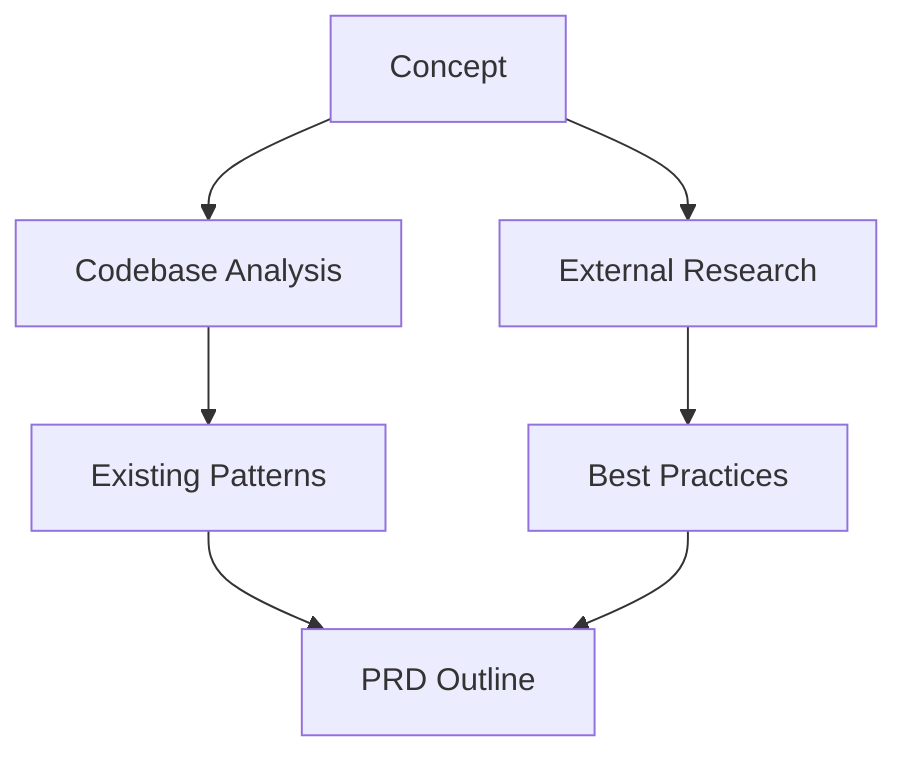

# PRP Planning Template v2 - Autonomous PRD Generation

## Purpose
Generate production-ready Product Requirements Documents (PRDs) with zero user input required.

## Execution Rules
```yaml
autonomous: true
fallbacks:
  timezone: UTC
  user_type: "developer"
  date_format: "ISO 8601"
validation:
  min_score: 85
  required_gates:
    - linting
    - unit_tests
    - performance
```

## Initial Concept
$ARGUMENTS

### Default Assumptions
1. No explicit requirements → Follow 12-Factor App principles
2. No personas → Technical user assumed
3. No timezone → UTC with offset support

## Research Process
### Phase 1: Automated Discovery


### Phase 2: Context Collection
1. **Codebase**:
   - Find similar features (`grep -r "pattern" src/`)
   - Identify test patterns
2. **External**:
   - WEB_SEARCH: "{concept} site:github.com"
   - DOCS_SEARCH: "library APIs"

## PRD Generation
### Output Structure
```markdown
1. Problem Statement
2. Technical Architecture
3. API Specifications
4. Validation Gates
5. Implementation Tasks
```

### Diagram Standards
```yaml
rules:
  max_nodes: 12
  colors:
    external: "#FF6B6B"
    errors: "#FF0000"
  annotations:
    required: true
    position: right
```

## Validation Pipeline
```bash
# Quality Gates
npm run lint
npm test
npx aicodemod verify --strict

# Performance
node benchmarks/execution-time.js
```

## Anti-Patterns
❌ Vague requirements  
❌ Unvalidated assumptions  
❌ Undocumented edge cases  

## Versioning
v2.0.0 - 2023-11-20  
- Added autonomous execution  
- Integrated AI validation  
- Standardized diagram rules